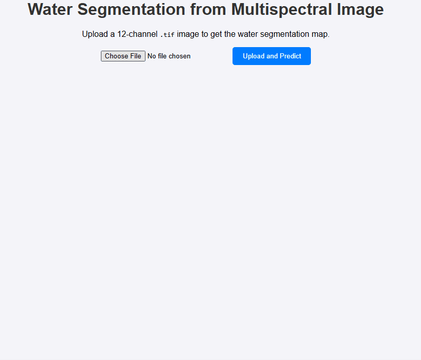
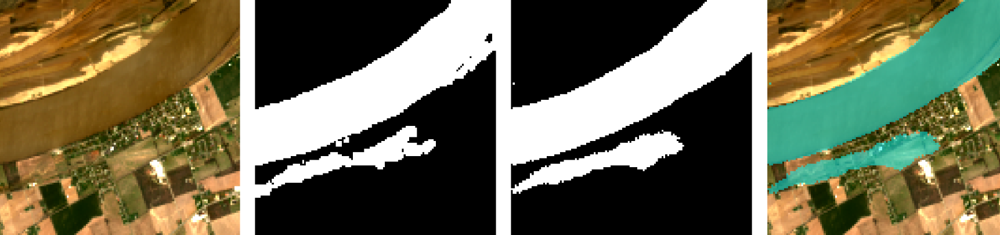
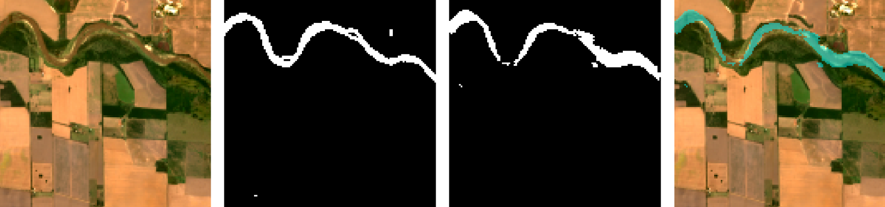

# 🛰️ Water Segmentation from Multispectral Satellite Imagery 💧

This repository documents the end-to-end journey of creating a deep learning model to identify and segment water bodies from 12-channel multispectral satellite imagery. The final model is deployed as an interactive web application using Flask.

## 🚀 Live Demo

The final application allows a user to upload a multispectral `.tif` image and instantly receive a segmentation mask overlaid on the true-color image, highlighting the detected water bodies.

## 🎯 Project Goal & Motivation

The automated monitoring of Earth's water resources—such as rivers, lakes, and coastlines—is crucial for environmental management, disaster response (e.g., flood mapping), and climate change studies. Manual analysis of satellite imagery is slow and not scalable. This project's goal was to build an automated, accurate, and accessible tool to perform this segmentation task using state-of-the-art deep learning techniques.

---

## 🧠 The Technical Journey: From Data to Deployment

This project was built following a structured machine learning pipeline, from understanding the data to deploying a functional product.

### 📊 1. Data Acquisition and Preprocessing

The foundation of any deep learning project is its data. This project utilizes a specialized dataset of satellite images.

-   **Data Type**: The dataset consists of 12-channel multispectral images (`.tif` format) and corresponding binary segmentation masks (`.png` format).
-   **Channels**: Unlike standard RGB images (3 channels), these images contain 12 spectral bands, including Near-Infrared (NIR) and Green bands, which are vital for water detection.
-   **Data Cleaning**: The first critical step was to ensure data integrity. A script was written to verify that every image had a corresponding mask and vice-versa, discarding any orphaned files to prevent training errors.

### 🔍 2. Exploratory Data Analysis (EDA) & The Power of Spectral Indices

Before modeling, it was essential to understand the data's properties. A key insight in remote sensing is the use of **spectral indices** to highlight specific features. For water, the **Normalized Difference Water Index (NDWI)** is extremely effective.

NDWI leverages the fact that water strongly absorbs Near-Infrared (NIR) light while reflecting Green light. The formula is:

> **NDWI = (Green - NIR) / (Green + NIR)**

By applying this formula, we can transform the 12-channel image into a single-channel image where water bodies have high positive values (appearing bright) and land/vegetation have negative values (appearing dark). This not only provided a strong visual confirmation of water locations but also highlighted the features our model would need to learn.

### 🏗️ 3. Model Architecture & Training Strategy

The core of the project is the segmentation model. A **U-Net architecture with a fine-tuned ResNet50 backbone** was chosen for this task.

-   **Why U-Net?**: The U-Net architecture is the industry standard for biomedical and satellite image segmentation. Its encoder-decoder structure with skip connections allows it to capture both high-level contextual information (what's in the image) and precise, low-level spatial details (exactly where the boundaries are).

-   **Why a ResNet50 Backbone?**: Instead of training an encoder from scratch, we use a ResNet50 model pre-trained on the massive ImageNet dataset. This technique, called **Transfer Learning**, provides our model with a powerful, pre-built understanding of shapes, textures, and patterns.

-   **The Fine-Tuning Strategy**: A two-stage training process was implemented for optimal performance:
    1.  **Feature Extraction**: Initially, the entire ResNet50 backbone was "frozen," and only the newly added decoder layers were trained. This allowed the decoder to learn how to interpret the powerful features from the backbone without disrupting the pre-trained weights.
    2.  **Fine-Tuning**: After the decoder stabilized, the last few layers of the ResNet50 backbone were "unfrozen." The entire model was then trained at a very low learning rate. This step subtly adjusts the pre-trained features to become even better at the specific task of water segmentation.

### 🚀 4. Deployment with Flask

A model is only useful if it can be used. The final step was to wrap our trained model in a simple web application using **Flask**.

The workflow is as follows:
1.  A user visits the web page and uploads a `.tif` image.
2.  The Flask backend receives the file.
3.  The image is preprocessed (normalized and formatted).
4.  The TensorFlow model runs `model.predict()` to generate a segmentation mask.
5.  A post-processing step uses Matplotlib to create a beautiful overlay of the prediction on a true-color version of the input image.
6.  The final result is sent back to the user's browser for display.

## ✨ Key Features

-   ✅ **High-Performance Model**: Achieves excellent segmentation results by combining the U-Net architecture with transfer learning from ResNet50.
-   ✅ **Advanced Data Handling**: Natively processes 12-channel multispectral `.tif` files, unlocking richer information than standard images.
-   ✅ **Intuitive User Interface**: A clean and simple web interface built with Flask allows for easy model interaction without any coding.
-   ✅ **Real-Time Visualization**: Dynamically generates and displays both a true-color version of the input and the final prediction overlay.

## 🖼️ Example Results

Here are some sample predictions from the final model, showcasing its accuracy on different scenes.

| True Color Input | Prediction Overlay |
| :--------------: | :----------------: |
|  |  |

## 🦾 Model Performance

Models were evaluated on the validation set using the **Intersection over Union (IoU)** metric. The results clearly show the benefit of transfer learning and fine-tuning.

| Model Architecture | Validation IoU |
| :--- | :---: |
| U-Net (from scratch) | 75.61% |
| ResNet50-U-Net (Feature Extraction) | 75.64% |
| **ResNet50-U-Net (Fine-Tuned)** | **78.27%** |

While the initial transfer learning approach offered a marginal improvement, **fine-tuning the ResNet50 encoder provided a significant 2.6% boost in IoU**, demonstrating its ability to adapt learned features to the specific domain of multispectral satellite imagery.

## 💻 Tech Stack

-   **Backend & Deployment**: 🐍 Python, 🌐 Flask
-   **Deep Learning**: 🧠 TensorFlow, Keras
-   **Image Processing**: 🎨 Matplotlib, 🖼️ Pillow, 🛰️ Tifffile, 🔢 NumPy
